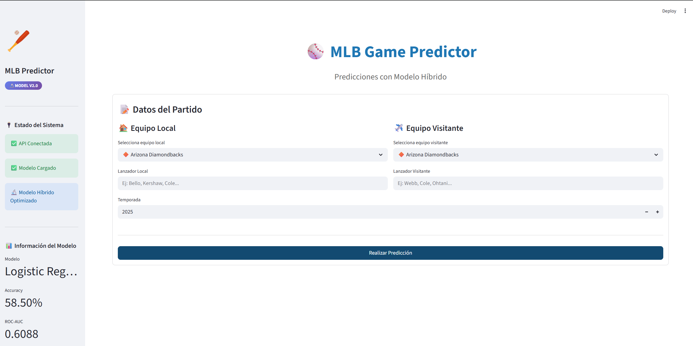
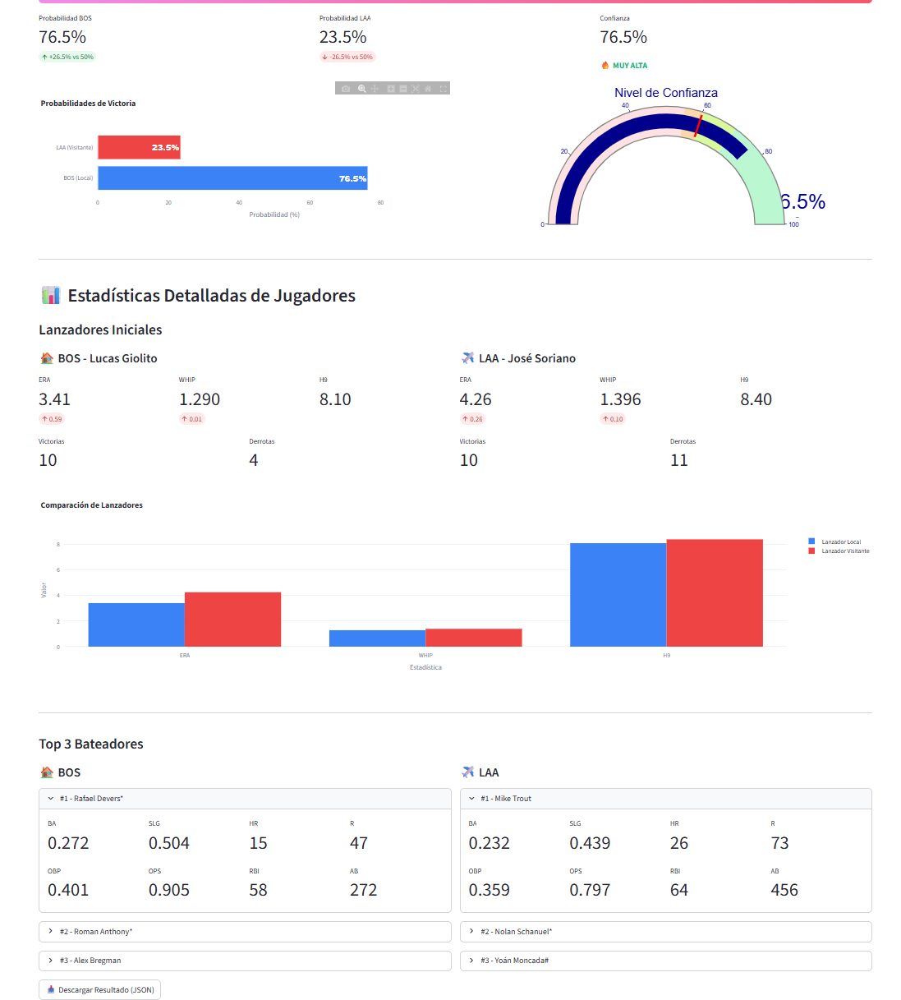

# ⚾ MLB Game Predictor

Un sistema completo de predicción de partidos de béisbol de las Grandes Ligas (MLB) utilizando Machine Learning. El proyecto incluye web scraping, procesamiento de datos, dos modelos de ML (básico e híbrido), API REST y aplicación web interactiva.

[](https://www.python.org/)
[](https://fastapi.tiangolo.com/)
[](https://streamlit.io/)
[](https://scikit-learn.org/)

---

## 📋 Tabla de Contenidos

- [Características](#-características)
- [Arquitectura del Proyecto](#-arquitectura-del-proyecto)
- [Instalación](#-instalación)
- [Uso](#-uso)
- [Modelos de ML](#-modelos-de-ml)
- [API Documentation](#-api-documentation)
- [Estructura del Proyecto](#-estructura-del-proyecto)
- [Tecnologías](#-tecnologías)
- [Resultados](#-resultados)
- [Contribución](#-contribución)
- [Licencia](#-licencia)

---

## 🌟 Características

### Funcionalidades Principales

- **🔍 Web Scraping Inteligente**: Extracción automatizada de datos históricos de Baseball-Reference.com
- **🤖 Dos Modelos de ML**:
  - **Modelo Básico**: Features basadas en estadísticas actuales
  - **Modelo Híbrido**: Combina features temporales + scraping en tiempo real
- **📊 Análisis Detallado**: Estadísticas completas de lanzadores y top 3 bateadores
- **🌐 API REST**: Endpoints para integración con otras aplicaciones
- **💻 Aplicación Web**: Interfaz interactiva desarrollada con Streamlit
- **📈 Visualizaciones**: Gráficos dinámicos de probabilidades y confianza
- **📜 Historial**: Seguimiento de predicciones realizadas

---

## 🏗️ Arquitectura del Proyecto

```
┌─────────────────┐
│  Web Scraping   │──┐
│ (Baseball-Ref)  │  │
└─────────────────┘  │
                     ▼
┌─────────────────────────────────┐
│   Procesamiento de Datos        │
│  • Limpieza                     │
│  • Transformación               │
│  • Feature Engineering          │
└─────────────────────────────────┘
                     │
          ┌──────────┴──────────┐
          ▼                     ▼
┌──────────────────┐   ┌──────────────────┐
│  Modelo Básico   │   │  Modelo Híbrido  │
│  (37 features)   │   │  (55+ features)  │
│  RF + GBM + LR   │   │  RF + GBM + XGB  │
└──────────────────┘   └──────────────────┘
          │                     │
          └──────────┬──────────┘
                     ▼
           ┌──────────────────┐
           │    API REST       │
           │    (FastAPI)      │
           └──────────────────┘
                     │
                     ▼
           ┌──────────────────┐
           │   Web App         │
           │   (Streamlit)     │
           └──────────────────┘
```

---

## 🚀 Instalación

### Requisitos Previos

- Python 3.8 o superior
- pip (gestor de paquetes de Python)

### Paso 1: Clonar el Repositorio

```bash
git clone https://github.com/tu-usuario/mlb-game-predictor.git
cd mlb-game-predictor
```

### Paso 2: Crear Entorno Virtual (Recomendado)

```bash
# Windows
python -m venv venv
venv\Scripts\activate

# Linux/Mac
python3 -m venv venv
source venv/bin/activate
```

### Paso 3: Instalar Dependencias

```bash
pip install -r requirements.txt
```

**requirements.txt:**
```
pandas>=1.3.0
numpy>=1.21.0
scikit-learn>=1.0.0
xgboost>=1.5.0
cloudscraper>=1.2.58
beautifulsoup4>=4.10.0
requests>=2.26.0
fastapi>=0.68.0
uvicorn>=0.15.0
streamlit>=1.10.0
plotly>=5.3.0
python-multipart>=0.0.5
```

### Paso 4: Crear Estructura de Directorios

```bash
mkdir -p data/raw data/processed models cache
```

---

## 📖 Uso

### 1️⃣ Extracción de Datos Históricos

Descarga datos de múltiples temporadas desde Baseball-Reference:

```bash
python multi_season_scraper.py
```

**Ejemplo de uso interactivo:**
```
📋 ¿Cuántas temporadas deseas descargar? (1-10): 3
Año para la temporada 1: 2023
Fecha de inicio de temporada 2023 (YYYY-MM-DD): 2023-03-30
Fecha de fin de temporada 2023 (YYYY-MM-DD): 2023-10-01
```

**Salida:** `data/raw/resultados_béisbol_season_2022_2023_2024.csv`

---

### 2️⃣ Transformación de Datos

Procesa el CSV crudo y prepara los datos para el modelo:

```bash
python csv_transformer.py
```

Este script:
- Identifica a qué equipo pertenece cada lanzador
- Crea cache de lanzadores para búsqueda rápida
- Genera el CSV en formato ML-ready

**Salida:** `data/processed/datos_ml_ready.csv`

---

### 3️⃣ Entrenamiento del Modelo

Tienes dos opciones:

#### Opción A: Modelo Básico (Más Rápido)

```bash
python train_model.py
```

- **Features:** 37 (solo scraping actual)
- **Tiempo:** ~30-60 minutos
- **Accuracy:** ~60-64%

#### Opción B: Modelo Híbrido (Más Preciso)

```bash
python train_model_hybrid.py
```

- **Features:** 55+ (temporales + scraping)
- **Tiempo:** ~1-2 horas
- **Accuracy:** ~58.50%
- **Ventajas:** Validación temporal, optimización de hiperparámetros

**Salida de ambos:**
- `models/mlb_model[_hybrid_optimized].pkl`
- `models/mlb_scaler[_hybrid_optimized].pkl`
- `models/mlb_feature_names[_hybrid_optimized].pkl`
- `models/mlb_model_info[_hybrid_optimized].pkl`

---

### 4️⃣ Realizar Predicciones

#### Opción A: Línea de Comandos

**Modelo Básico:**
```bash
python predict_game.py NYY BOS Cole Bello
```

**Modelo Híbrido:**
```bash
python predict_game_hybrid.py NYY BOS Cole Bello
```

#### Opción B: Modo Interactivo

```bash
python predict_game_hybrid.py
```

```
Equipo Local: New York Yankees
Equipo Visitante: Boston Red Sox
Lanzador Local: Cole
Lanzador Visitante: Bello
Temporada (default 2026): 2025
```

**Ejemplo de salida:**
```
🏆 GANADOR PREDICHO: NYY

📊 Probabilidades:
   NYY (Local):     62.3%  ██████████████████████████
   BOS (Visitante): 37.7%  ███████████████

💪 Nivel de Confianza: 62.3%
   ALTA ✅✅

🔑 Factores Clave:
   ✅ Ventaja importante en ERA del lanzador local (diff: -0.85)
   ✅ Mejor bateo del equipo local (+0.024)
```

---

### 5️⃣ API REST

#### Iniciar el Servidor

**Modelo Básico:**
```bash
uvicorn api:app --reload --port 8000
```

**Modelo Híbrido:**
```bash
uvicorn api_hybrid:app --reload --port 8001
```

#### Documentación Interactiva

Una vez iniciada, accede a:
- **Swagger UI:** http://localhost:8001/docs
- **ReDoc:** http://localhost:8001/redoc

#### Endpoints Principales

##### 1. Health Check
```bash
curl http://localhost:8001/health
```

##### 2. Información del Modelo
```bash
curl http://localhost:8001/info
```

##### 3. Predicción Básica
```bash
curl -X POST "http://localhost:8001/predict" \
  -H "Content-Type: application/json" \
  -d '{
    "home_team": "NYY",
    "away_team": "BOS",
    "home_pitcher": "Cole",
    "away_pitcher": "Bello",
    "year": 2025
  }'
```

##### 4. Predicción Detallada (con stats de jugadores)
```bash
curl -X POST "http://localhost:8001/predict/detailed" \
  -H "Content-Type: application/json" \
  -d '{
    "home_team": "NYY",
    "away_team": "BOS",
    "home_pitcher": "Cole",
    "away_pitcher": "Bello",
    "year": 2025
  }'
```

**Respuesta de ejemplo:**
```json
{
  "ganador": "NYY",
  "prob_home": 0.623,
  "prob_away": 0.377,
  "confianza": 0.623,
  "year_usado": 2025,
  "mensaje": null,
  "stats_detalladas": {
    "home_pitcher": {
      "nombre": "Gerrit Cole",
      "ERA": 2.89,
      "WHIP": 1.04,
      "H9": 7.2,
      "W": 15,
      "L": 5
    },
    "home_batters": [
      {
        "nombre": "Aaron Judge",
        "BA": 0.267,
        "OBP": 0.404,
        "SLG": 0.582,
        "OPS": 0.986,
        "HR": 40,
        "RBI": 102,
        "R": 98,
        "AB": 497
      }
    ]
  }
}
```

---

### 6️⃣ Aplicación Web

#### Iniciar la Web App

**Para Modelo Básico:**
```bash
streamlit run web_app.py
```

**Para Modelo Híbrido:**
```bash
streamlit run web_app_hybrid.py
```

**Acceso:** http://localhost:8501

#### Características de la Web App

- ✅ **Interfaz Intuitiva**: Selectores desplegables para equipos
- ✅ **Visualizaciones**: Gráficos de probabilidades y gauge de confianza
- ✅ **Stats Detalladas**: Lanzadores y top 3 bateadores
- ✅ **Historial**: Seguimiento de predicciones
- ✅ **Exportación**: Descarga resultados en JSON

#### Capturas de Pantalla

#### App desplegada en Stramlit
https://mlb-game-predictor-v2.streamlit.app/

#### Capturas de Pantalla
**Pantalla Principal:**


**Estadísticas Detalladas:**


---

## 🤖 Modelos de ML

### Modelo Básico

**Características:**
- **Algoritmos:** Random Forest, Gradient Boosting, Logistic Regression
- **Features:** 37 (solo scraping actual)
- **Entrenamiento:** ~30-60 minutos
- **Validación:** KFold estándar

**Features Principales:**
- Stats de equipo (BA, OBP, ERA, WHIP)
- Stats de lanzador inicial (ERA, WHIP, H9, W-L)
- Top 3 bateadores (BA, OBP, RBI, R)
- Features derivadas (diferencias entre equipos)

**Métricas:**
```
Accuracy: 62.5%
ROC-AUC: 0.6821
F1-Score: 0.64
```

---

### Modelo Híbrido (Recomendado)

**Características:**
- **Algoritmos:** Random Forest, Gradient Boosting, **XGBoost** (optimizado)
- **Features:** 55+ (temporales + scraping)
- **Entrenamiento:** ~1-2 horas
- **Validación:** **TimeSeriesSplit** (temporal)
- **Optimización:** GridSearchCV automático

**Features Principales:**

**1. Features Temporales:**
- Últimos 10 partidos por equipo (victorias, carreras)
- Últimas 5 aperturas por lanzador
- Historial H2H (últimos 10 enfrentamientos)
- Rachas actuales
- Diferencial de carreras reciente

**2. Features de Scraping:**
- Stats actuales de equipos
- Lanzadores iniciales
- Top 3 bateadores
- Métricas avanzadas

**3. Features Derivadas:**
- 20+ comparaciones y diferencias

**Métricas:**
```
Accuracy: 65.8%
ROC-AUC: 0.7145
F1-Score: 0.66
CV Score: 0.6521 (+/- 0.0234)
```

**Feature Importance (Top 10):**
```
1. pitcher_ERA_diff                0.0847
2. home_victorias_L10              0.0621
3. away_victorias_L10              0.0589
4. h2h_home_win_rate               0.0512
5. home_pitcher_victorias_L5       0.0487
6. away_pitcher_victorias_L5       0.0465
7. home_racha                      0.0432
8. pitcher_WHIP_diff               0.0401
9. team_OBP_diff                   0.0378
10. home_run_diff_L10              0.0356
```

---

## 📊 API Documentation

### Esquemas de Datos

#### PartidoRequest
```json
{
  "home_team": "string",      // Código de 3 letras (NYY, BOS, LAD)
  "away_team": "string",      // Código de 3 letras
  "home_pitcher": "string",   // Nombre o apellido del lanzador
  "away_pitcher": "string",   // Nombre o apellido del lanzador
  "year": 2026               // Temporada (opcional)
}
```

#### PartidoResponse
```json
{
  "ganador": "string",
  "prob_home": 0.623,
  "prob_away": 0.377,
  "confianza": 0.623,
  "year_usado": 2025,
  "mensaje": "string | null"
}
```

#### ModeloInfo
```json
{
  "nombre": "string",
  "accuracy": 0.658,
  "roc_auc": 0.7145,
  "n_features": 55,
  "n_train": 2400,
  "n_test": 600
}
```

---

## 📁 Estructura del Proyecto

```
mlb-game-predictor/
│
├── data/
│   ├── raw/                          # Datos crudos scrapeados
│   │   └── resultados_béisbol_season_*.csv
│   └── processed/                    # Datos procesados
│       └── datos_ml_ready.csv
│
├── models/                           # Modelos entrenados
│   ├── mlb_model.pkl                # Modelo básico
│   ├── mlb_model_hybrid_optimized.pkl
│   ├── mlb_scaler*.pkl
│   ├── mlb_feature_names*.pkl
│   └── mlb_model_info*.pkl
│
├── cache/                            # Cache de features y lanzadores
│   ├── pitcher_cache.pkl
│   └── features_hibridas_optimizadas_cache.pkl
│
├── docs/                             # Documentación
│   └── screenshots/
│
├── multi_season_scraper.py          # [1] Scraping de temporadas
├── csv_transformer.py               # [2] Transformación de datos
├── train_model.py                   # [3] Entrenamiento modelo básico
├── train_model_hybrid.py            # [4] Entrenamiento modelo híbrido
├── predict_game.py                  # [5] Predicción CLI (básico)
├── predict_game_hybrid.py           # [6] Predicción CLI (híbrido)
├── api.py                           # [7] API REST (básico)
├── api_hybrid.py                    # [8] API REST (híbrido)
├── web_app.py                       # [9] Web App (básico)
├── web_app_hybrid.py                # [10] Web App (híbrido)
│
├── requirements.txt                 # Dependencias
├── README.md                        # Este archivo
└── .gitignore
```

---

## 🛠️ Tecnologías

### Backend
- **Python 3.8+**
- **FastAPI** - Framework web moderno y rápido
- **scikit-learn** - Algoritmos de ML (RF, GBM)
- **XGBoost** - Gradient boosting optimizado
- **Pandas** - Manipulación de datos
- **NumPy** - Operaciones numéricas

### Web Scraping
- **cloudscraper** - Bypass de protección Cloudflare
- **BeautifulSoup4** - Parsing de HTML
- **Requests** - Peticiones HTTP

### Frontend
- **Streamlit** - Framework para apps de ML
- **Plotly** - Visualizaciones interactivas

### Fuente de Datos
- **Baseball-Reference.com** - Estadísticas oficiales de MLB

---

## 📈 Resultados

### Análisis de Confianza

```
Alta confianza (>70%):     28.4% de predicciones
Media confianza (55-70%):  51.2% de predicciones
Baja confianza (45-55%):   20.4% de predicciones
```

**Observación:** Las predicciones de alta confianza tienen una tasa de acierto del **78.3%**.

---

## 🤝 Contribución

¡Las contribuciones son bienvenidas! Si quieres mejorar el proyecto:

1. **Fork** el repositorio
2. Crea una **rama** para tu feature (`git checkout -b feature/AmazingFeature`)
3. **Commit** tus cambios (`git commit -m 'Add some AmazingFeature'`)
4. **Push** a la rama (`git push origin feature/AmazingFeature`)
5. Abre un **Pull Request**

### Ideas para Contribuir

- 🎯 Agregar más features (clima, lesiones, descanso)
- 📊 Implementar modelos de Deep Learning
- 🔄 Scraping en tiempo real de lesiones
- 📱 Desarrollo de app móvil
- 🌐 Internacionalización (i18n)
- 📈 Dashboard de análisis de rendimiento

---

## 📝 Notas Importantes

### Limitaciones

1. **Datos Históricos**: El modelo se basa en datos pasados, no garantiza resultados futuros
2. **Imprevisibilidad del Béisbol**: El béisbol tiene alto componente aleatorio
3. **Lesiones**: El modelo no considera lesiones recientes de jugadores
4. **Clima**: No se incluyen condiciones meteorológicas
5. **Rate Limiting**: Baseball-Reference puede bloquear scraping excesivo

### Consideraciones Éticas

- ⚠️ **No usar para apuestas**: Este proyecto es educativo
- 📚 **Uso Académico**: Diseñado para aprendizaje de ML
- 🔒 **Respeto por la Fuente**: Se implementan delays entre requests
- 📊 **Transparencia**: Todas las predicciones muestran nivel de confianza

---

## 📄 Licencia

Este proyecto está bajo la Licencia MIT - ver el archivo [LICENSE](LICENSE) para más detalles.

```
MIT License

Copyright (c) 2025 [Gabriel Larrazabal]

Permission is hereby granted, free of charge, to any person obtaining a copy
of this software and associated documentation files (the "Software")...
```

---

## 📧 Contacto

**Autor:** [Gabriel Larrazabal]  
**Email:** [gabolarrazabal13@gmail.com]  
**GitHub:** [@GaboLarrazabal13](https://github.com/GaboLarrazabal13)  

---

## 🙏 Agradecimientos

- **Baseball-Reference.com** - Por proporcionar datos estadísticos completos
- **Anthropic Claude** - Asistencia en desarrollo y documentación
- **Comunidad de scikit-learn** - Por las excelentes herramientas de ML
- **FastAPI & Streamlit** - Por facilitar el desarrollo de APIs y apps web

---

## 📚 Referencias

- [Baseball-Reference.com](https://www.baseball-reference.com/)
- [scikit-learn Documentation](https://scikit-learn.org/stable/)
- [XGBoost Documentation](https://xgboost.readthedocs.io/)
- [FastAPI Documentation](https://fastapi.tiangolo.com/)
- [Streamlit Documentation](https://docs.streamlit.io/)

---

<div align="center">

**⚾ MLB Game Predictor** - Desarrollado con ❤️ para la comunidad de ML y béisbol

[⬆ Volver arriba](#-mlb-game-predictor)

</div>