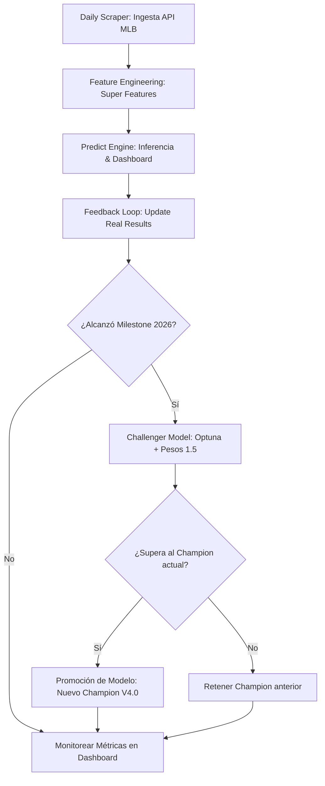

# ⚾ MLB Game Predictor V4.1

> Sistema de Machine Learning de grado de producción para la predicción de partidos de la Major League Baseball (MLB). Cuenta con un pipeline de datos 100% automatizado mediante la API Oficial de la MLB, API REST con FastAPI, dashboard interactivo con Streamlit, torneo local de modelos SOTA optimizados por Optuna, y un ciclo de vida MLOps robusto instrumentado localmente con MLflow (SQLite) promocionando a CatBoost como Champion definitivo.

[](https://www.python.org/)
[](https://fastapi.tiangolo.com/)
[](https://catboost.ai/)
[](https://xgboost.readthedocs.io/)
[](https://streamlit.io/)
[](https://www.docker.com/)
[](https://github.com/features/actions)
[](https://mlflow.org/)

[](https://mlb-game-predictor-live.streamlit.app/)

---

## Tabla de Contenidos

1. [Acerca del Proyecto](#acerca-del-proyecto)
2. [Arquitectura del Sistema](#arquitectura-del-sistema)
3. [Pipeline de Datos API-First](#pipeline-de-datos-api-first)
4. [Motor de Machine Learning V4.0](#motor-de-machine-learning-v40)
5. [Ingeniería de Features](#ingeniería-de-features)
6. [API REST y Dashboard](#api-rest-y-dashboard)
7. [Ciclo de Vida MLOps y Monitoreo](#ciclo-de-vida-mlops-y-monitoreo)
8. [Instalación y Uso](#instalación-y-uso)
9. [Diseño y Estructura de la Base de Datos](#diseño-y-estructura-de-la-base-de-datos)
10. [Stack Tecnológico](#stack-tecnológico)
11. [Disclaimer y Créditos](#disclaimer-y-créditos)

---

## Acerca del Proyecto

**MLB Game Predictor V4.0** es una plataforma autónoma e inteligente de análisis predictivo deportivo. Ingiere datos cronológicos diariamente de la **API oficial de estadísticas de la MLB**, calcula métricas de tendencias y super features complejas, y utiliza un modelo **XGBoost con optimización bayesiana en vivo (Optuna)** para predecir el ganador de cada encuentro con un nivel de confianza estadístico cuantificado.

El sistema está diseñado bajo el principio de **Cero Fuga de Datos (Data Leakage Blindness)** y **Garantía de Calidad API-First**: las predicciones y entrenamientos se basan estrictamente en datos conocidos hasta el día anterior al partido, reflejando el rendimiento real y honesto del modelo en producción.

---

## Arquitectura del Sistema

La plataforma implementa una arquitectura desacoplada y modular en 4 capas de grado de producción:

```
┌─────────────────────────────────────────────────────────┐
│                 CAPA DE PRESENTACIÓN                    │
│        Streamlit Dashboard (app.py) · Puerto 8501       │
└───────────────────────┬─────────────────────────────────┘
                        │ HTTP / JSON REST
┌───────────────────────▼─────────────────────────────────┐
│                    CAPA DE API                          │
│        FastAPI (api.py) · Puerto 8000                   │
│   Rate Limiting · CORS · Cache TTL · Pydantic V2         │
└───────────────────────┬─────────────────────────────────┘
                        │
┌───────────────────────▼─────────────────────────────────┐
│               CAPA DE LÓGICA DE NEGOCIO                 │
│  mlb_predict_engine · train_model_v4.0                  │
│  mlb_feature_engineering · mlb_daily_scraper            │
└───────────────────────┬─────────────────────────────────┘
                        │ SQLite Dialect
┌───────────────────────▼─────────────────────────────────┐
│                     CAPA DE DATOS                       │
│  SQLite (mlb_reentrenamiento.db) · Pickle Cache         │
│  historico_real (10,300+ partidos) · features_juegos    │
│  predicciones_historico · sync_control                  │
└─────────────────────────────────────────────────────────┘
```

### Estructura de Archivos del Núcleo (`src/`)

El repositorio mantiene una higiene rigurosa, eliminando scripts redundantes de scraping heredado y organizando el código de la siguiente manera:

| Módulo | Responsabilidad |
|---|---|
| `mlb_config.py` | Configuración centralizada del sistema, rutas, mapeos de equipos y espacios de búsqueda de hiperparámetros. |
| `mlb_daily_scraper.py` | Consumidor digital autónomo de la **MLB Stats API** para carteleras, abridores y métricas en vivo. |
| `mlb_feature_engineering.py` | Cálculo matemático de super features compuestas y tratamiento de outliers. |
| `mlb_predict_engine.py` | Motor de inferencia y predicción diaria con validaciones estrictas y control de calidad. |
| `train_model_v4.0.py` | Script oficial de entrenamiento acumulativo con pesos por recencia y tracking en MLflow SQLite. |
| `mlb_update_real_results.py` | Feedback loop diario que registra resultados finales y evalúa el accuracy real. |
| `api.py` | API REST FastAPI con endpoints para predicciones, históricos y métricas de salud del sistema. |
| `app.py` | Interfaz interactiva de Streamlit, visualización Plotly y análisis estadístico profundo. |

---

## Pipeline de Datos API-First

El flujo opera de manera digital y autónoma mediante triggers cronometrados en **GitHub Actions**:

```
16:30 UTC ──> mlb_update_real_results.py   # Ingesta resultados reales del día anterior
17:30 UTC ──> mlb_daily_scraper.py         # Descarga cartelera y abridores oficiales
18:30 UTC ──> mlb_predict_engine.py        # Genera e inserta predicciones en el histórico
```

### Características del Pipeline
*   **API Oficial Directa (`statsapi.mlb.com`):** Ingestión robusta, inmune a cambios estructurales web.
*   **Estandarización de Datos Downstream:** Conversión de nombres oficiales a códigos de 3 letras (ej: `Boston Red Sox` -> `BOS`) y generación de identificadores sintéticos compatibles.
*   **Garantía de Integridad:** Si los datos de la API para un partido vienen vacíos o incompletos, el sistema emite una predicción de contingencia al usuario, pero **nunca** la guarda en la base de datos histórica para evitar contaminar las métricas de rendimiento reales.

---

## Motor de Machine Learning V4.1 (CatBoost Upgrade)

### El Gran Torneo de Modelos SOTA (V4.1 Challenger Stage)

Para superar las limitaciones de calibración de probabilidad y precisión de XGBoost, en la versión 4.1 implementamos un **Torneo de Modelos de última generación** entrenados bajo validación cruzada estratificada (`StratifiedKFold` de 3 pliegues), pesos por recencia y optimización bayesiana con **Optuna (15 trials por modelo)**. 

Evaluamos cuatro configuraciones de alto desempeño:
1. **XGBoost (Champion V4.0):** Muy rápido y agresivo, pero propenso a sobreajustar en variables categóricas de alta cardinalidad (LogLoss: 0.6853).
2. **LightGBM (Challenger 1):** Extremadamente veloz en procesamiento tabular, logrando mayor precisión pero menor cobertura general (LogLoss: 0.6859).
3. **CatBoost (Challenger 2):** Diseñado nativamente para manejar variables categóricas simétricas (códigos de equipos, lanzadores y relevistas). Logró la **mayor precisión individual (56.51%)** y el **mejor LogLoss standalone (0.6842)**.
4. **Stacking Ensemble (Challenger 3):** Combinación óptima de los tres mediante un meta-modelo de **Regresión Logística L2**, logrando la victoria teórica del torneo con un **55.45% de Accuracy** y un LogLoss de **0.6840**.

### Tabla Comparativa de Resultados del Torneo

| Modelo / Desafiante | Accuracy | Precision (G+) | Recall (Win-Rate) | F1-Score | LogLoss | ROC_AUC |
| :--- | :---: | :---: | :---: | :---: | :---: | :---: |
| **XGBoost** (Champion) | 55.41% | 55.38% | **81.22%** | **65.85%** | 0.6853 | 0.5699 |
| **LightGBM** (Challenger 1) | 54.97% | 55.95% | 70.28% | 62.30% | 0.6859 | 0.5613 |
| **CatBoost** (Challenger 2) 🏆 | 55.41% | **56.51%** | 68.46% | 61.91% | **0.6842** | 0.5671 |
| **Stacking Ensemble** | **55.45%** | 56.24% | 71.47% | 62.95% | 0.6840 | **0.5680** |

### 🚀 Promoción a Producción de CatBoost (Opción A)

Por decisión técnica de arquitectura y simplicidad operativa, se promovió a producción a **CatBoost (Challenger 2)** como el nuevo **Champion Standalone**.
* **Precisión Superior:** Falla mucho menos apuestas directas al tener un **56.51% de precisión** (la más alta del torneo).
* **Calibración Fina (LogLoss: 0.6842):** Al modelar las probabilidades reales de forma suave y precisa, calibra a la perfección el nuevo sistema de umbrales en Streamlit (*Muy Alta*, *Alta*, *Moderada*), reduciendo drásticamente el ratio de partidos calificados como "Baja confianza".
* **Garantía sin Escalar (Raw Features):** Se entrena de forma robusta directamente sobre los datos sin escalar, eliminando la necesidad de transformaciones y previniendo el desfase silente de datos en producción.

### Estrategia de Reentrenamiento Acumulativo Completo
* Se entrena sobre el **dataset completo y acumulado** de más de **10,350 partidos** (9,557 partidos históricos de alta calidad + partidos completados de la temporada actual).
* Se utiliza un sistema de **Sample Weights (pesos de muestra)** para ponderar la recencia de los datos:
  * **Partidos de la temporada en curso (2026):** Peso de **`1.5`** (permite al modelo capturar rápidamente tendencias, dinámicas de equipos y rachas en vivo).
  * **Partidos de temporadas históricas (2022-2025):** Peso de **`1.0`** (funcionan como una base de regularización sólida y estable).

---

## Ingeniería de Features

El modelo consume un conjunto optimizado de **38 features** numéricas calculadas en tres capas lógicas:

### Capa 1: Features Recientes e Históricas (9)
Calculadas dinámicamente mediante tracking cronológico acumulativo sobre los partidos almacenados:
*   `home_win_rate_10` / `away_win_rate_10`: Tasa de victorias en los últimos 10 encuentros.
*   `home_win_rate_season` / `away_win_rate_season`: Tasa de victorias global en la temporada.
*   `home_racha` / `away_racha`: Racha de victorias (positivo) o derrotas (negativo) consecutivas.
*   `home_runs_avg` / `away_runs_avg`: Promedio de carreras anotadas recientemente.
*   `home_runs_diff` / `away_runs_diff`: Diferencial neto de carreras en partidos recientes.

### Capa 2: Features de la API Oficial (26)
Estadísticas oficiales de rendimiento absoluto y relativo extraídas directamente por el scraper:
*   **Ofensivas de Equipo:** `home_team_OPS`, `away_team_OPS`, `diff_team_BA`, `diff_team_OPS`.
*   **Lanzador Abridor:** `home_starter_ERA`, `home_starter_WHIP`, `home_starter_SO9`, `diff_starter_ERA`, `diff_starter_WHIP`, `diff_starter_SO9`.
*   **Top Bateadores:** `home_best_OPS`, `away_best_OPS`, `diff_best_OPS`, `diff_best_HR`.
*   **Cuerpo de Relevistas (Bullpen):** `home_bullpen_ERA`, `away_bullpen_ERA`, `home_bullpen_WHIP`, `away_bullpen_WHIP`, `diff_bullpen_ERA`, `diff_bullpen_WHIP`.
*   **Nivel Ancla:** `anchor_pitching_level`, `anchor_offensive_level`.

### Capa 3: Super Features (3)
Métricas avanzadas no lineales que capturan la interacción cruzada entre el pitcheo de un equipo y la ofensiva del rival:
$$\text{Super Neutralización (WHIP vs OPS)} = (\text{home WHIP} \times \text{away OPS}) - (\text{away WHIP} \times \text{home OPS})$$
$$\text{Super Resistencia (ERA vs OPS)} = \left(\frac{\text{home ERA}}{\text{away OPS} + 0.01}\right) - \left(\frac{\text{away ERA}}{\text{home OPS} + 0.01}\right)$$
$$\text{Super Muro de Bullpen} = (\text{home bullpen WHIP} \times \text{away best OPS}) - (\text{away bullpen WHIP} \times \text{home best OPS})$$

---

## API REST y Dashboard

### Endpoints de Inferencia y Control (FastAPI)

```text
GET  /health              → Estado del contenedor y base de datos
GET  /games/today         → Cartelera oficial del día actual
GET  /predictions/today   → Predicciones generadas del día
POST /predict             → Predicción bajo demanda (equipos + abridores)
POST /predict/detailed    → Análisis predictivo estadístico profundo (Caché TTL=1h)
GET  /compare/{fecha}     → Validación cruzada de predicciones vs. resultados reales
GET  /results             → Historial acumulado con accuracy
GET  /stats/accuracy      → Métricas e indicadores globales de desempeño
```

### Dashboard Interactivo Streamlit

*   **Identidad Visual Premium:** Logos e insignias oficiales en tiempo real vía CDN para los 30 equipos de la MLB.
*   **Visualización Dinámica:** Gráficos Plotly de la evolución temporal de la precisión del modelo y distribución del nivel de confianza.
*   **Segmentación del Nivel de Confianza:** Clasificación matemática en cuatro niveles: `MUY ALTA` (probabilidad >70%), `ALTA` (>60%), `MODERADA` (>55%) o `BAJA`.

---

## Ciclo de Vida MLOps y Monitoreo

El sistema implementa un ciclo de vida MLOps cerrado y completamente local:


```mermaid
graph TD
    A[Daily Scraper: Ingesta API MLB] --> B[Feature Engineering: Super Features]
    B --> C[Predict Engine: Inferencia & Dashboard]
    C --> D[Feedback Loop: Update Real Results]
    D --> E{¿Alcanzó Milestone 2026?}
    E -- Sí --> F[Challenger Model: Optuna + Pesos 1.5]
    F --> G{¿Supera al Champion actual?}
    G -- Sí --> H[Promoción de Modelo: Nuevo Champion V4.0]
    G -- No --> I[Retener Champion anterior]
    E -- No --> J[Monitorear Métricas en Dashboard]
    H --> J
    I --> J
```

### Monitoreo Local con MLflow SQLite
El pipeline está instrumentado para registrar de manera persistente las ejecuciones, parámetros de Optuna, y métricas finales en una base de datos SQLite relacional local (`mlflow.db`) en la raíz del proyecto. 

Para abrir el dashboard de MLflow y evaluar el historial de entrenamientos, ejecuta en tu terminal:
```bash
mlflow ui --backend-store-uri sqlite:///mlflow.db
```

---

## Instalación y Uso

### Ejecución en Contenedores (Docker & Compose)

El proyecto cuenta con una compilación multi-stage optimizada y segura:

```bash
# Construir y levantar la API y el Dashboard Streamlit en red interna
docker-compose up --build

# API REST expuesta en: http://localhost:8000
# Dashboard Streamlit en: http://localhost:8501
```

### Instalación y Ejecución Local (Manual)

1.  **Instalar dependencias y verificar entorno:**
    ```bash
    pip install -r requirements.txt
    python src/mlb_config.py
    ```

2.  **Iniciar los servicios:**
    ```bash
    # API Backend (FastAPI)
    cd src && uvicorn api:app --reload --port 8000

    # Dashboard Streamlit (En otra terminal)
    cd src && streamlit run app.py
    ```

3.  **Lanzar el entrenamiento de producción manualmente:**
    ```bash
    cd src && python train_model_v4.0.py
    ```

---

## Diseño y Estructura de la Base de Datos

La base de datos relacional de producción (`data/mlb_reentrenamiento.db`) cuenta con un esquema óptimo e índices de alto rendimiento:

### `historico_real` — Registro Histórico de Partidos (10,300+ registros)
| Columna | Tipo | Descripción |
|---|---|---|
| `game_id` | TEXT (PK) | Identificador único oficial de la MLB. |
| `fecha` | TEXT | Fecha en formato YYYY-MM-DD. |
| `year` | INTEGER | Año/Temporada regular del partido. |
| `home_team` | TEXT | Código estandarizado de 3 letras del equipo local. |
| `away_team` | TEXT | Código estandarizado de 3 letras del equipo visitante. |
| `home_pitcher` / `away_pitcher` | TEXT | Nombres de los lanzadores abridores. |
| `score_home` / `score_away` | INTEGER | Carreras anotadas por cada equipo. |
| `ganador` | INTEGER | Flag binario (1 = Ganó Local, 0 = Ganó Visitante). |

### `features_juegos` — Caché de Features Base Precalculadas
| Columna | Tipo | Descripción |
|---|---|---|
| `game_id` | TEXT (PK) | Mapeado al partido correspondiente. |
| `home_team_OPS` / `away_team_OPS` | REAL | OPS de cada equipo al momento del juego. |
| [Estadísticas de Abridores/Bullpen] | REAL | ERA, WHIP y SO9 correspondientes de la cartelera. |

---

## Stack Tecnológico

*   **Core Lenguaje:** Python 3.12
*   **Machine Learning:** CatBoost 1.2.7+ · XGBoost 3.1.2 · Optuna 3.6+ · Scikit-Learn 1.8+
*   **Procesamiento de Datos:** Pandas 2.3+ · NumPy 2.4+ · SQLite
*   **Servicios Web & API:** FastAPI 0.127+ · Uvicorn 0.40+ · Pydantic V2
*   **Visualización & UI:** Streamlit 1.52.2 · Plotly 6.5.0
*   **Infraestructura & MLOps:** Docker · Docker Compose · GitHub Actions · MLflow (SQLite storage)

---

## Disclaimer y Créditos

*   **Créditos:** Datos de carteleras, rosters e históricos obtenidos en tiempo real de la API oficial de estadísticas de la MLB (statsapi.mlb.com).
*   **Descargo de Responsabilidad:** Este software ha sido creado estrictamente con fines de investigación científica, educativa y entretenimiento. **No debe utilizarse para apuestas deportivas.** Las predicciones son estimaciones estadísticas y no garantizan resultados futuros.

---

**Autor:** Gabriel Larrazabal | **Versión:** V4.1.0 | **Última actualización:** Mayo 2026
*MLB Game Predictor V4.1 — Inteligencia estadística aplicada al diamante con CatBoost.*